You have received an Azure Pass code.

Now follow [the instructions below](https://www.microsoftazurepass.com/howto) to activate your azure pass account.

------------------------------------------------------------------------

Creating a Microsoft Azure Pass Subscription
============================================

Creating an Azure Pass subscription is a two step process.
1.  Redeem your Azure Pass Promo Code
2.  Activate your subscription

Step 1: Redeeming a Microsoft Azure Pass Promo Code: 
=====================================================

1
##### Open a browser and navigate to: [www.microsoftazurepass.com](http://www.microsoftazurepass.com/)

It is recommended you use an In-Private Browser session. Other log-ins
can persist and cause errors during the activation step.

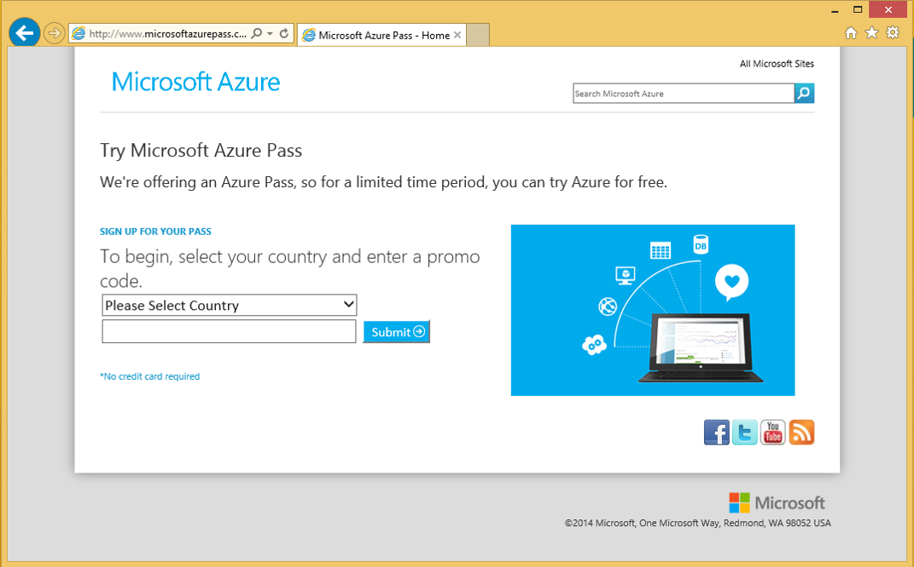

2
##### Select your country in the drop down menu.

##### Enter your Azure Pass Promo Code.

##### Click ‘Submit’.

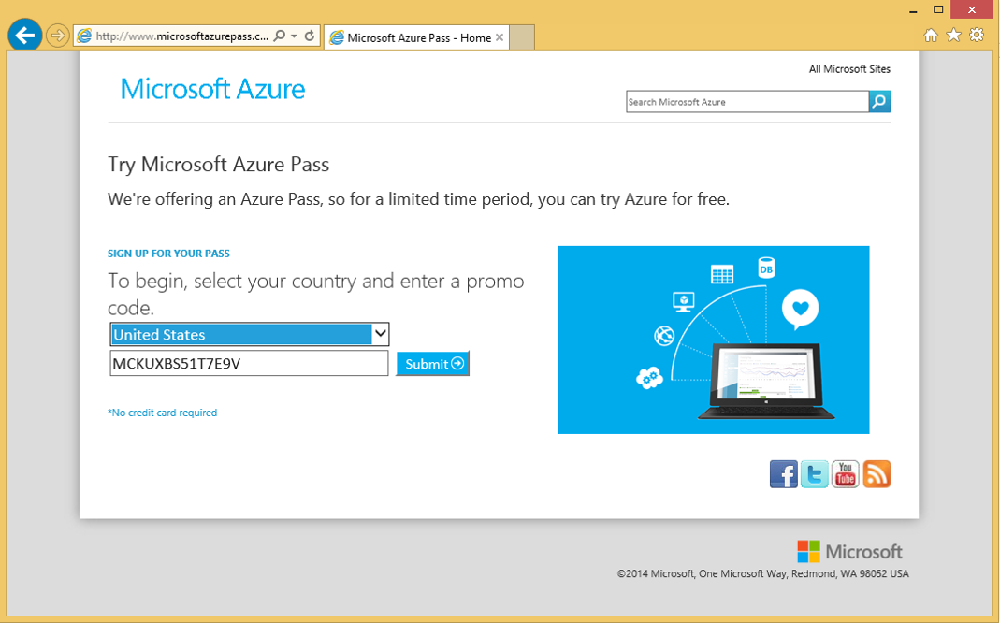

3
##### Click “Sign in” to sign into your Microsoft Account (Live ID) or Organizational Account (Org ID).

The Azure subscription will be created in this account

##### If you do not have a Microsoft Account or Org ID you can create one by clicking on the link

(instructions can be found in appendix 1)

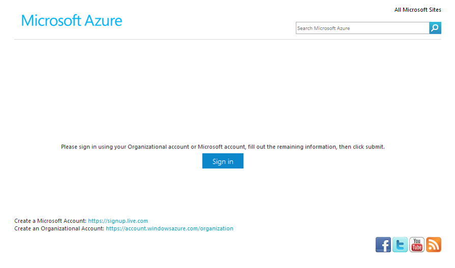

4
##### Enter your account login information and select “Sign In”.

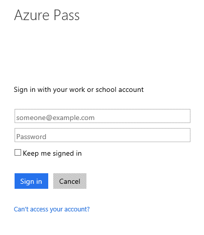\
### Or

\
##### If your account is both a Live ID and Org ID please select which account you would like to use.

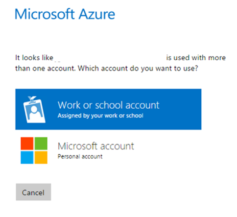

5
##### Confirm Information

\
##### Click ‘Submit’

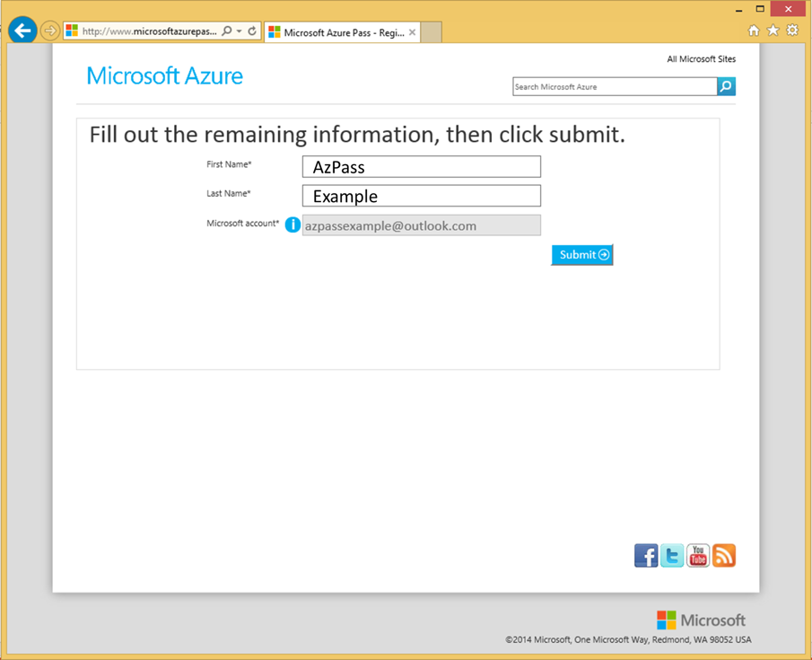

6
##### Click ‘Activate’

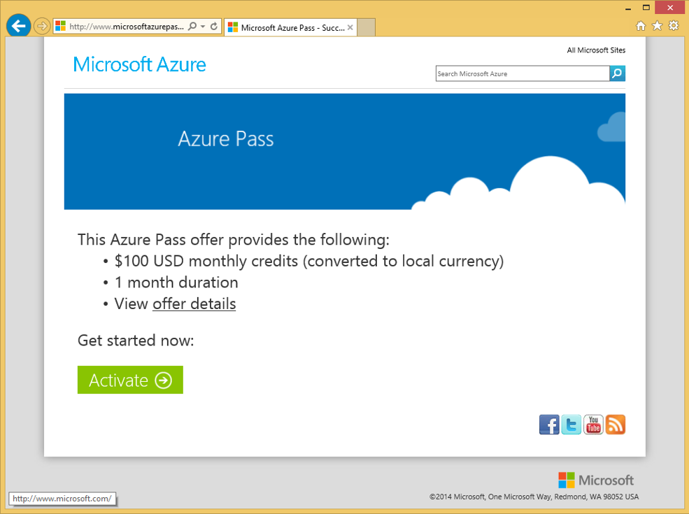

\
Congratulations, you have successfully completed Step 1 and redeemed your Azure Pass Promo Code.
================================================================================================

\
\
Step 2: Activating a Microsoft Azure Pass Subscription:
========================================================

\
\
Method 1
========

Almost all users will be able to activate their subscription using
Method 1.

However, if you receive an error message or are not able to complete you
will be able to use Method 2.

1
##### Fill Out the Requested Information

This needs to match your account information

##### Click ‘Sign up’

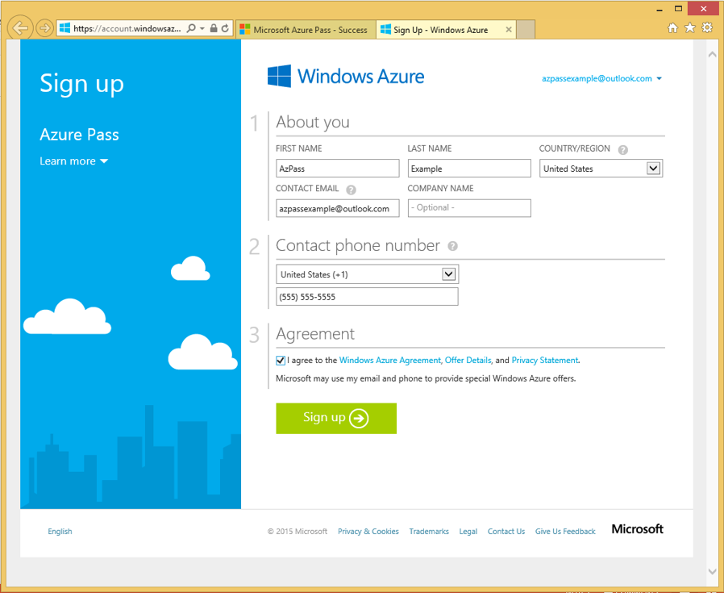

2
##### It make take a few minutes, **DO NOT** refresh or close your browser.

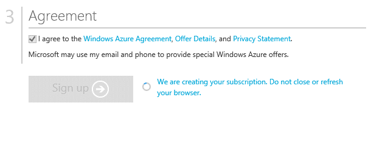

3
##### Your subscription has been created and is being provisioned, this can take up to 10 minutes. If it takes longer, reach out to support.

You may need to refresh the page

##### After your subscription is provisioned you can start using by clicking ‘Portal.’

##### In the future you can navigate directly to the management portal: [http://portal.azure.com](http://portal.azure.com/)

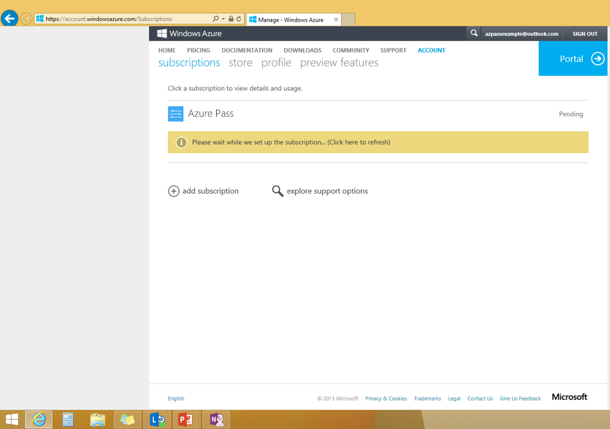

\
\
Method 2
========

If you received an error message or were unable to complete Method 1,
then use Method 2.

1
##### If you want to verify you successfully redeemed your promo code, you can attempt to redeem your code again.

##### If you get the message ‘promo code is already used,’ you have successfully completed Step 1 of the process.

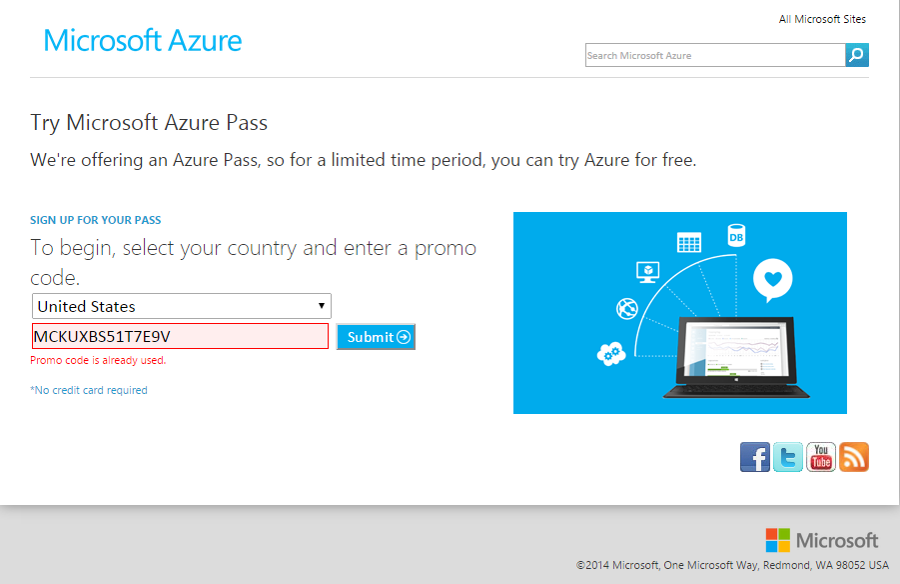

\
##### Choose one of the following 

2
#### This is your first subscription

##### Log into the account portal of your Microsoft Account:

[http://account.windowsazure.com](http://account.windowsazure.com/)

##### Click ‘Sign up for a free trial’

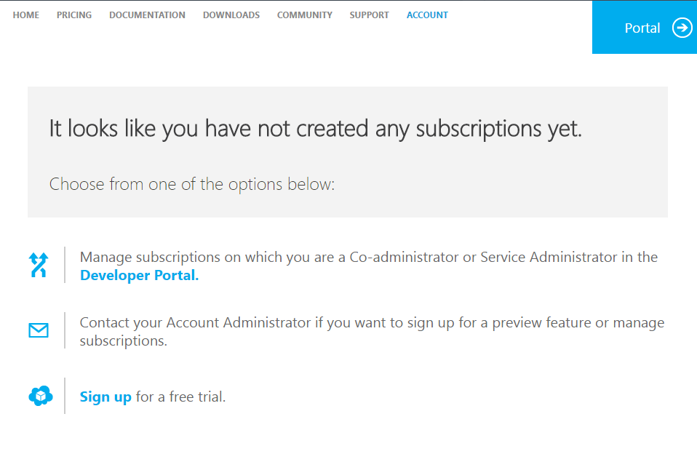\
### Or 

\
#### You have other subscriptions

##### Log into the account portal of your Microsoft Account :

[http://account.windowsazure.com](http://account.windowsazure.com/)

##### Click ‘subscriptions’

##### Click ‘add subscription’

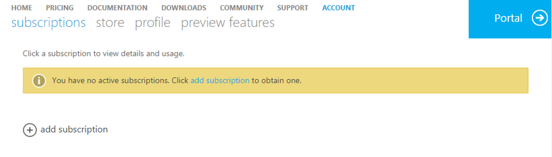

3
##### Click ‘Select the Upgrade Offer (Azure Pass)’

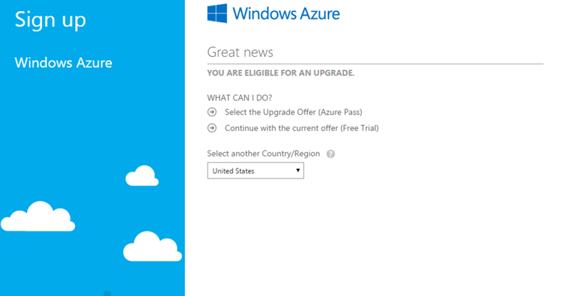\
### Or 

\
##### Scroll though the list of options and click ‘Azure Pass’

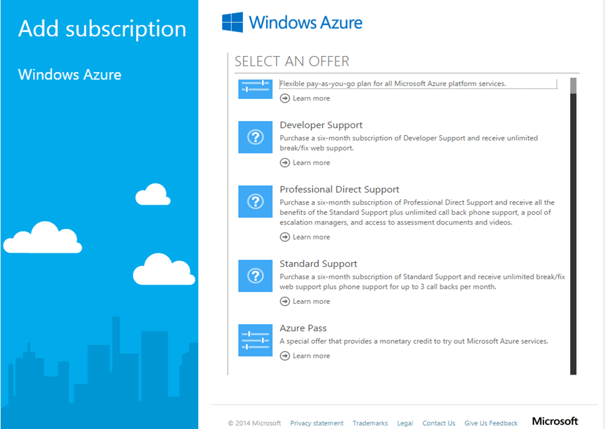

##### If the Azure Pass option is not available: 

##### Confirm that you are logged into the correct account. 

##### Confirm you are logged into your Microsoft Account (LiveID) not your Organizational ID, if you have both (See Appendix 2). 

4
##### Complete the requested information

##### Click ‘Sign up’

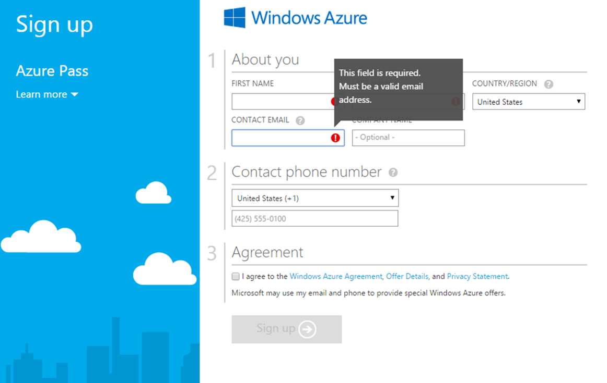

##### Azure Pass subscriptions do not require a credit card, if you are asked for a credit card confirm you are signing up for Azure Pass.

5
##### It make take a few minutes, **DO NOT** refresh or close your browser.

6
##### Your subscription has been created and is being provisioned, this can take up to 10 minutes. If it takes longer, reach out to support.

You may need to refresh the page

##### After your subscription is provisioned you can start using by clicking ‘Portal.’

##### In the future you can navigate directly to the management portal: [http://manage.windowsazure.com](http://manage.windowsazure.com/)

\
\
Appendix 1: 
===========

Creating a New Microsoft Account: 
=================================

\
You can create a new Microsoft Account, or you can use an existing email address. 
=================================================================================

A
#### New Microsoft Account

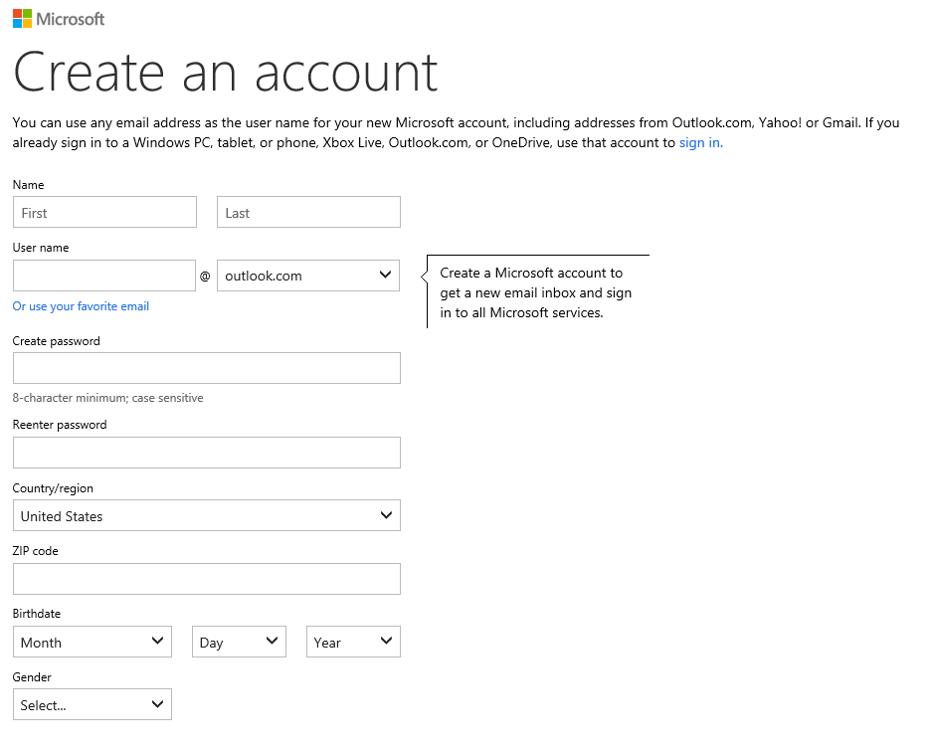

\
### Or

\

#### Existing Email

B
##### Create a new Organizational Account

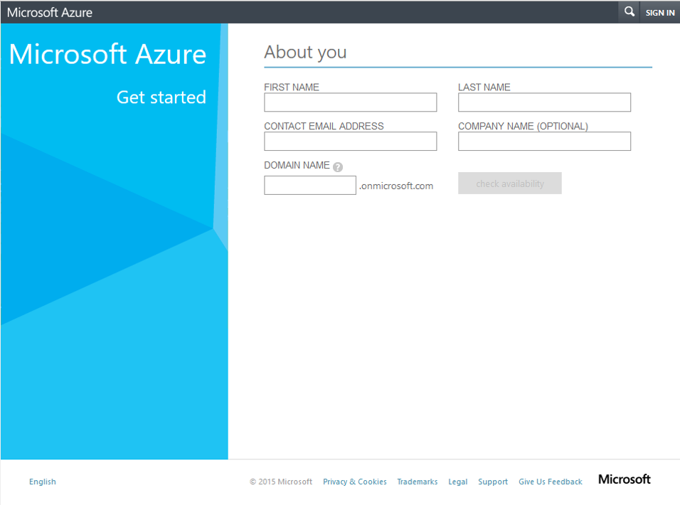

\
\
Appendix 2: 
===========

Confirming Microsoft Account Login 
==================================

A
##### If you confirmed you are in the correct account, then check that you are using your Microsoft Account (LiveID) or Organizational Account by going to URL: <http://account.windowsazure.com/test>

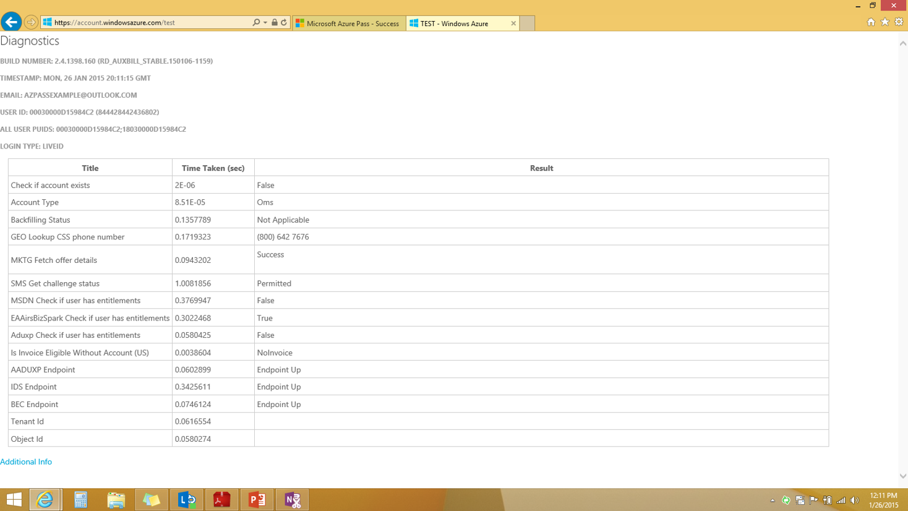

\

For issues or additional questions [Create a Support
Case](http://azure.microsoft.com/en-us/support/options/).

[Privacy &
cookies](https://privacy.microsoft.com/en-us/privacystatement) [Terms of
use](https://azure.microsoft.com/en-us/support/legal/website-terms-of-use/)\

